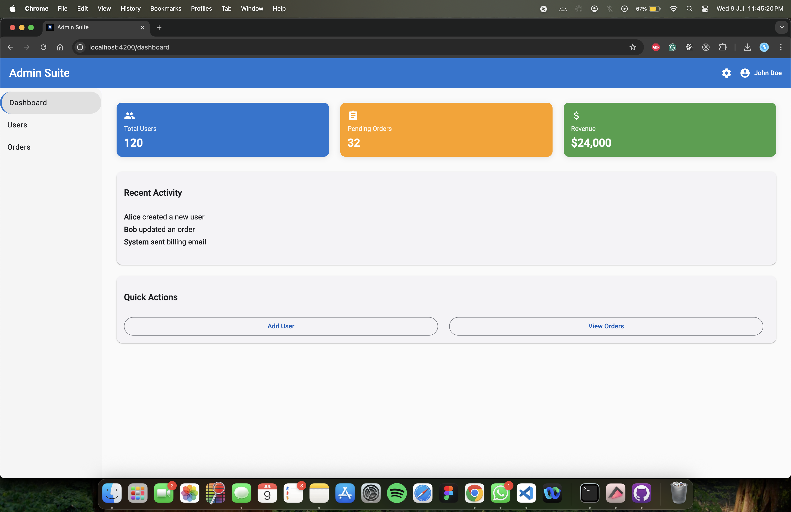

# AdminSuite

AdminSuite is a professional admin dashboard built with Angular and Angular Material. It features a modern UI, modular architecture, and reusable components suitable for internal dashboards, admin portals, or analytics platforms.



## 🚀 Features

- Angular 17 with modern standalone component architecture
- Angular Material UI with responsive layout
- Top navigation bar with user info
- Side navigation with routing integration
- User table with pagination and action buttons
- Reusable component for adding, editing, and viewing users
- Dashboard with KPI cards, activity feed, and quick actions
- Modular folder structure and lazy loading support

## 🛠️ Tech Stack

- Angular
- TypeScript
- SCSS
- Angular Material

## 📁 Folder Structure

```
src/
├── app/
│   ├── app.component.ts
│   ├── app.routes.ts
│   ├── pages/
│   │   ├── dashboard/
│   │   ├── users/
│   │   ├── orders/
│   │   └── settings/
│   └── shared/
│       └── material.module.ts
```

## 📦 Setup Instructions

1. Clone the repository
2. Run `npm install`
3. Run `ng serve`
4. Open in browser: `http://localhost:4200`

## 📄 License

This project is open for use in personal and professional portfolios.
